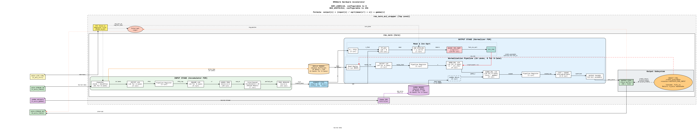
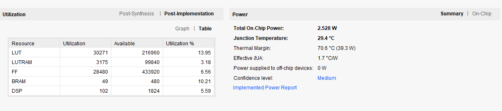
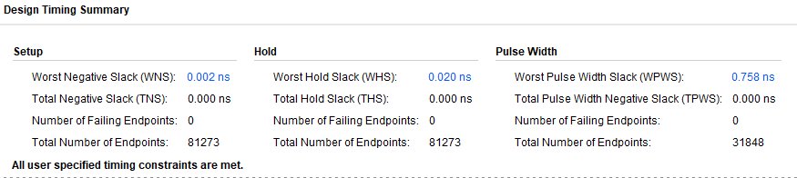
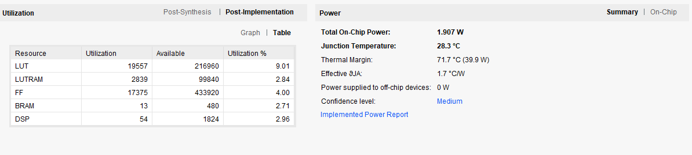
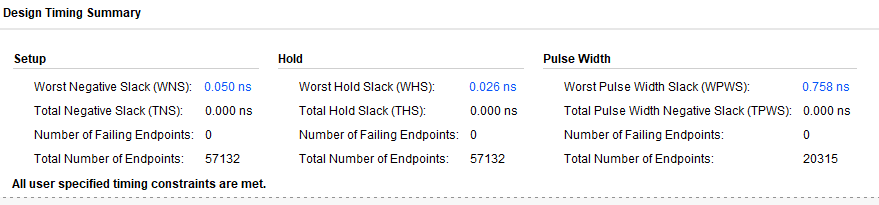

# RMSNorm Hardware Accelerator

A hardware implementation of Root Mean Square Layer Normalization (RMSNorm) for Transformer models. This IP core is designed for Xilinx Ultrascale+ FPGAs and provides AXI4-Stream and AXI4-Lite interfaces for system integration.

## Overview

RMSNorm is a simplified normalization layer used in models like LLaMA and Gemma. It computes:

```
output[i] = (input[i] / RMS(input)) * gamma[i]
where RMS = sqrt(mean(input^2) + epsilon)
```

This accelerator processes vectors of configurable size (up to 12288 elements) with support for mixed precision compute.

---

### Block Diagram

<p align="center">
  
</p>

## Architecture

The design uses a **two-stage decoupled pipeline** that allows the input and output stages to operate concurrently on different vectors.

### Input Stage (Accumulator FSM)

The input stage processes incoming data and computes the sum of squares:

1. **INT to FP32 Conversion**: Converts INT32 or INT8 input to 32-bit floating point 
2. **Squaring**: Computes x² for each lane using FP32 multipliers 
3. **Adder Tree**: Parallel reduction of NUM_LANES values to single sum 
4. **Interleaved Accumulators**: 8 parallel accumulators to handle FP adder's latency without pipeline stalls
5. **Replay Buffer**: Stores original input data for later normalization

### Output Stage (Normalizer FSM)

The output stage normalizes data using the computed RMS:

1. **Mean Calculation**: Divides sum by N 
2. **Epsilon Addition**: Adds epsilon for numerical stability 
3. **Inverse Square Root**: Quake's fast inverse sqrt with Newton-Raphson 
4. **Normalization**: Multiplies input by inv_rms 
5. **Gamma Scaling**: Multiplies by learned gamma weights 
6. **Quantization**: Converts FP32 to BF16 or INT8 
7. **Output Packer**: Assembles lanes into output AXI beat

### Flow Control

- **Credit-Based System**: Prevents output FIFO overflow during downstream backpressure
- **Handoff FIFO**: Decouples input and output stages for concurrent processing
- **Skid Buffers**: Ensures AXI-Stream protocol compliance during backpressure

---

## Interfaces

| Interface | Type | Width | Description |
|-----------|------|-------|-------------|
| `s_axi_ctrl` | AXI4-Lite Slave | 32-bit | Control registers |
| `s_axis` | AXI4-Stream Slave | DATA_WIDTH | Input data stream |
| `m_axis` | AXI4-Stream Master | DATA_WIDTH | Output data stream |
| `s_axis_gamma` | AXI4-Stream Slave | DATA_WIDTH | Gamma weight loading |
| `interrupt` | Wire | 1-bit | Completion interrupt |

### Register Map

| Address | Name | Access | Description |
|---------|------|--------|-------------|
| 0x0000 | CTRL | W | Bit 0: Start, Bit 1: Soft Reset |
| 0x0004 | STATUS | R | Bit 0: Busy, Bit 1: Done |
| 0x0008 | INTR_EN | R/W | Interrupt enable |
| 0x000C | INTR_STATUS | R/W1C | Interrupt status (write 1 to clear) |
| 0x0010 | EPSILON | R/W | RMS epsilon value (FP32, default: ~1e-5) |

---

## Configuration Parameters

| Parameter | Default | Description |
|-----------|---------|-------------|
| `MAX_VECTOR_SIZE` | 12288 | Maximum supported vector dimension |
| `NUM_LANES` | 8 | Parallel processing lanes |
| `DATA_WIDTH` | 256 | AXI-Stream data bus width (bits) |
| `INPUT_PRECISION` | "INT32" | Input format: "INT32" or "INT8" |
| `PRECISION` | "BF16" | Output format: "BF16" or "INT8" |
| `USE_DSP` | 1 | 1 = DSP48E2 multipliers, 0 = Wallace Tree |

### Derived Parameters

| Parameter | Formula | Example (8 lanes, 256-bit, INT32→BF16) |
|-----------|---------|----------------------------------------|
| `INPUT_PACK_SIZE` | DATA_WIDTH / INPUT_BITS | 256 / 32 = 8 elements/beat |
| `OUTPUT_PACK_SIZE` | DATA_WIDTH / OUTPUT_BITS | 256 / 16 = 16 elements/beat |
| `PACK_BEATS` | OUTPUT_PACK_SIZE / NUM_LANES | 16 / 8 = 2 internal cycles/output |
| `NUM_ACCUMULATORS` | FP_ADD_LATENCY + 1 | 7 + 1 = 8 |

---

## Benchmarks

All benchmarks measured on Xilinx KU5P at 385 MHz with behavioral simulation.

**Test Configuration:**
- NUM_LANES = 16
- DATA_WIDTH = 512 bits
- INPUT_PRECISION = INT32
- OUTPUT_PRECISION = BF16

### Single Vector Latency

Performance for processing a single vector (cold start) vs. back-to-back vectors (sustained throughput):

#### Single Vector (Cold Start)

| Dimension | Total Cycles | Throughput (elem/cyc) | Time (μs) |
|-----------|--------------|----------------------|-----------|
| 64        | 175          | 0.37                 | 0.46      |
| 1152      | 312          | 3.69                 | 0.81      |
| 2048      | 423          | 4.84                 | 1.10      |
| 3072      | 550          | 5.59                 | 1.43      |
| 4096      | 678          | 6.04                 | 1.76      |
| 5120      | 806          | 6.35                 | 2.10      |
| 6144      | 935          | 6.57                 | 2.43      |
| 8192      | 1190         | 6.88                 | 3.09      |
| 12288     | 1704         | 7.21                 | 4.43      |

#### Back-to-Back (10 Vectors - Sustained Throughput)

| Dimension | Avg Cycles/Vector | Total Cycles | Throughput (elem/cyc) | Time/Vector (μs) |
|-----------|-------------------|--------------|----------------------|------------------|
| 64        | 48.0              | 480          | 1.33                 | 0.12             |
| 1152      | 122.7             | 1227         | 9.39                 | 0.32             |
| 2048      | 184.3             | 1843         | 11.11                | 0.48             |
| 3072      | 254.8             | 2548         | 12.06                | 0.66             |
| 4096      | 325.0             | 3250         | 12.60                | 0.84             |
| 5120      | 395.5             | 3955         | 12.95                | 1.03             |
| 6144      | 466.0             | 4660         | 13.18                | 1.21             |
| 8192      | 606.8             | 6068         | 13.50                | 1.58             |
| 12288     | 888.2             | 8882         | 13.83                | 2.31             |

**Configuration:** INPUT=INT32, OUTPUT=BF16, LANES=16, BUS_WIDTH=512 bits  
**Clock:** 385 MHz (2.60 ns period)

**Key Observations:**
- Back-to-back throughput is **2-14× higher** than single-vector throughput
- Pipeline stays **fully utilized** when processing continuous streams
- Maximum sustained throughput approaches **14 elements/cycle** (limited by 16 lanes)

### Comparison with Apex Compute's RMSNorm accelerator

Comparison with Apex Compute's FPGA RMSNorm accelerator for dimension 1152:

| Metric | **This Work** | Apex Compute | Advantage |
|--------|---------------|--------------|-----------|
| **FPGA** | Kintex UltraScale+ | Kintex UltraScale+ | Same |
| **Clock Frequency** | 385 MHz | 333 MHz | **+11% faster** |
| **Precision** | INT32→BF16 | INT4/FP4/INT8→BF16 | Higher input precision |
| **Single Vector Latency** | 0.84 μs (311 cycles) | 0.785 μs (261 cycles) | -6.5% |
| **Sustained Throughput** | **0.33 μs (122.8 cyc)** | 0.785 μs (261 cycles) | **2.4× faster** |
| **Elements/Cycle (Sustained)** | **9.38 elem/cyc** | 4.41 elem/cyc | **2.1× higher** |

**Key Takeaways:**
- Our **back-to-back throughput** (0.33 μs) beats reported time by **2.4×**
- Higher clock frequency (385 vs 333 MHz) contributes to performance advantage
- **Even at their 333 MHz:** Our design would be 0.37 μs → still **2.1× faster** (clock-normalized)
- Our design uses **higher precision inputs** (INT32 vs INT4/INT8) yet still faster
- Sustained throughput demonstrates superior **pipeline efficiency** for real LLM workloads

*Note: Apex Compute numbers from their published benchmarks. Their measurement methodology may exclude data transfer overhead, while ours includes full end-to-end AXI transfers.*


### Implementation Results

#### Performance & Timing (Xilinx KCU5P FPGA, -2 Speed Grade)

**Achieved Fmax:** 385 MHz (2.60 ns period)

| Timing Metric | Value | Status |
|---------------|-------|--------|
| WNS (Setup)   | +0.002 ns | PASS |
| WHS (Hold)    | +0.020 ns | PASS |
| WPWS (Pulse Width) | +0.758 ns | PASS |

**Timing Constraints:**
- AXI interface delays: ±0.52ns (20% of clock period)
- Models PCB trace delays, register Tco/Tsu, and setup/hold margins
- Full IO timing validation included in Out-of-Context synthesis

#### Critical Path Analysis

The critical path (2.593ns @ 385 MHz) is located in the **normalization multiplier array**, specifically in the gamma weight multiplication stage:

**Path:** Register → DSP48E2 (Multiply) → DSP48E2 (Cascade) → DSP Output  
**Location:** `gen_norm_mul[11].u_norm_mul` (SLICE_X59Y91 → DSP48E2_X10Y36/Y37)

**Delay Breakdown:**
- **Total Path Delay:** 2.593ns
  - Logic: 2.198ns (84.8%) - Dominated by DSP48E2 operations
  - Routing: 0.395ns (15.2%) - Excellent placement
- **Critical Stages:**
  - DSP Multiplier: 0.609ns (23.5%) - Largest single contributor
  - DSP ALU (cascade): 0.546ns + 0.571ns (43.1%)
  - DSP Input/Output logic: 0.392ns (15.0%)

The critical path uses **two cascaded DSP48E2 slices** (PCOUT→PCIN) for wide precision multiplication of the normalized value with gamma weights. The routing delay of only 15.2% indicates optimal placement by Vivado.

**Why This Limits Frequency:**  
The DSP48E2 multiplier and ALU stages are hard macros with fixed delays. Further frequency improvement would require:
- Algorithmic changes to reduce precision
- Additional pipeline stages (increasing latency)
- Faster FPGA family or ASIC

The design is **compute-bound**.

#### Resource Utilization

Detailed resource utilization and power analysis for the full design.

Since the MAX_VECTOR_SIZE only affects the BRAM usage it is better to use it with 12288 value, if user does not have any BRAM usage concerns.

**MAX_VECTOR_SIZE=12288, NUM_LANES=16, DATA_WIDTH=512**



**Timing Report:**



**MAX_VECTOR_SIZE=1152, NUM_LANES=8, DATA_WIDTH=512**



**Timing Report:**



---

## Usage

### Basic Operation Sequence

```
1. Load gamma weights (once per dimension change):
   - Stream via s_axis_gamma, or
   - Write via AXI-Lite to 0x1000-0x2FFF (slower)

2. Configure epsilon (optional, default ~1e-5):
   - Write FP32 value to register 0x0010

3. Start processing:
   - Write 0x01 to CTRL register (0x0000)

4. Stream input data:
   - Send N elements via s_axis
   - Assert tlast on final beat

5. Receive output data:
   - Collect normalized output from m_axis

6. Wait for completion:
   - Poll STATUS register, or
   - Wait for interrupt (if enabled)
```

### Soft Reset

Writing 0x02 to CTRL triggers a soft reset that:
- Clears all internal state machines
- Empties FIFO and pointers
- Preserves gamma weights and configuration
- Ready for new operation after 16 cycles

---


## Files

```
RMSNorm/
├── rms_norm.sv                  # Core accelerator (1700 lines)
├── rms_norm_axi_wrapper.sv      # AXI wrapper with control registers
├── axi_assertions.svh           # SVA protocol assertions
├── architecture_description.txt # Detailed RTL documentation
├── README.md                    # This file
└── sim/
    ├── rms_norm_tb.sv           # Core-only testbench
    └── rms_norm_wrapper_tb.sv   # Full wrapper testbench
```

---

## Design Characteristics & Limitations

**Configurable at Synthesis:**
- Maximum vector size: `MAX_VECTOR_SIZE` (default 12288)
- Processing lanes: `NUM_LANES` (tested: 8, 16)
- Bus width: `DATA_WIDTH` (tested: 256, 512 bits)
- Precision modes: INT32/INT8 → BF16/INT8

**Operational Constraints:**
- Input vector size must be divisible by `NUM_LANES` (padding required otherwise)
- Gamma weights must be reloaded when switching vector dimensions
- Vectors processed sequentially at AXI interface (one `tlast` boundary at a time)

**Pipeline Behavior:**
- Internal stages are **decoupled** via handoff FIFO and double-buffered memory
- Up to **2 vectors in flight**: Input FSM can begin vector N while Output FSM finishes vector N-1
- Achieves **2-14× higher sustained throughput** vs single-vector latency (see benchmarks)

---

## Author

Yusuf SUR
